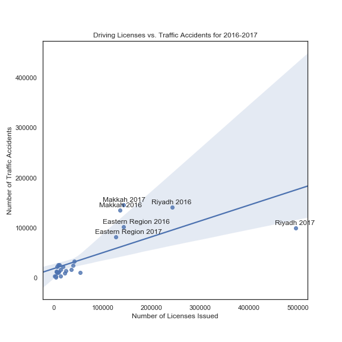
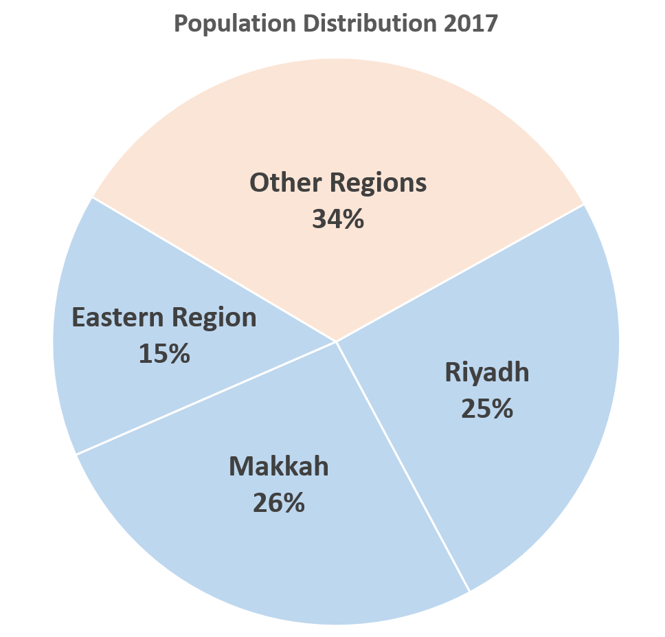
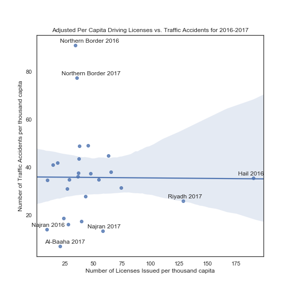

# Does issuing more drivers licenses mean more accidents on Saudi roads?

With a quarter of the Saudi population below the age of 15, and soon to be of legal driving age, it would be interesting to see if there is a trend between the rate of newly issued licenses and the rate of accidents.

### Scattering the dots

Looking over the data the general trend seems fairly obvious: the more licenses issued, the more accidents we observe.. right? Mmm, *perhaps* not.

### Something's fishy in the desert

Looking at the plot we notice something interesting. All the largest values come from three regions: **Riyadh**, **Makkah** and the **Eastern Province**, why could this be?

Thinking over it, aren't these the most populous in the Kingdom? Time to gather regional data.

### The Big 3

It turns out over 65% of the population lives in one of the big 3 regions. That means that naturally both the number of licenses issued and number of accidents will be higher based on their sheer numbers when comparing to the other 10 regions.

This lead us to read into what is possibly a false trend in the first plot thanks to not adjusting for a variable (the population) that is highly correlated with both our horizontal and vertical axes in this case. But how do we account for this?

### Enter per capita

By dividing each regions numbers by the population who are eligible to get a license (males over 15 years of age at the time) we can adjust our figures to represent licenses and accidents per capita, a metric far more useful when comparing regions of different sizes in terms of population.

### Scattering the dots... once more

By looking at the updated plot the positive relationship we previously saw seems to have disappeared completely. In the end it looks like we won't be able to infer much about the number of accidents from the number of licenses issued in a year.

### The silver lining
Although we weren't able to reasonably predict accidents from licenses issued, looking at the plot we are able to see an interesting trend that might open up avenues for insight. It looks like the accidents per capita in the **Northern Border** are alarmingly high in comparison to the other regions, and on the flip side it looks like **Najran** has had consistently low rates of accidents per capita. Studying these two outliers might help identify the variables that affect the rate of accidents in the Kingdom, but that's a study for another day.
